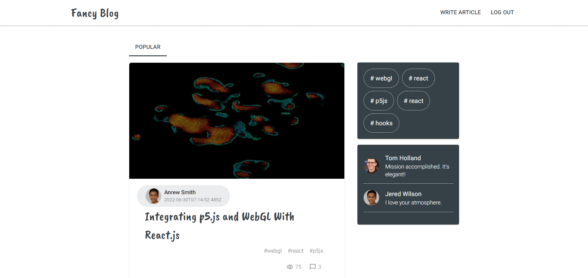

# :book: Table of Content:

- [About The Project](#project-description)
- [Goals and Scenarios](#goals)
- [Technologies](#technologies)
- [Getting Started](#getting-started)
- [Landing page](#landing-page)
- [Screenshots](#screenshots)
- [To do](#todo)
- [Demo](#demo)

## :pencil: About The Project

How to deploy fullstack application.

## :rocket: Goals and Scenarios

The main functionalities:

- login
- register
- filtering by tag
- write post
- update/delete post

## :computer: Technologies

- JavaScript
- ReactJS 18, React Hooks
- React Router v6
- Axios + Fetch
- Redux
- CSS-Modules / SCSS
- React Content Loader
- React Pagination
- Lodash.Debounce
- Code Splitting

## :pushpin: Getting Started

First of all download the project. Then in the project directory use the following command to start the application:

```bash
  npm start
```

The app will be in the development mode.\
Open [http://localhost:3000](http://localhost:3000) to view it in the browser.

## Screenshots

### Landing page



### Cart


### Empty cart


### Not found page


## To do(and some bugs)

There are some issues with filtering: you can not filter items while you are not on the first page. This is connected with mockapi service, which allows to do filtering and searching, but does it wrong when you use PAGINATION at the same time.

Functionalities to be implemented:

- filtering by popular/new
- adding avatar photo, updating user settings

## Demo

- Current demo version: [https://react-blog-cyan.vercel.app/](https://react-blog-cyan.vercel.app/)
- Backend part : [https://github.com/Anastasiya999/blog-backend](https://github.com/Anastasiya999/blog-backend)
