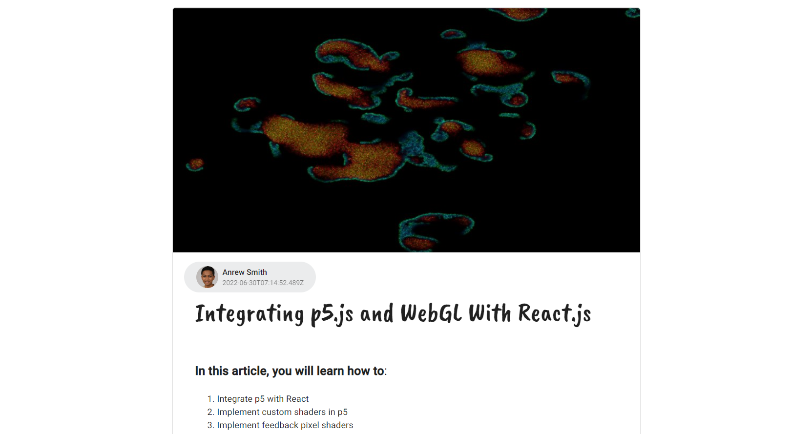
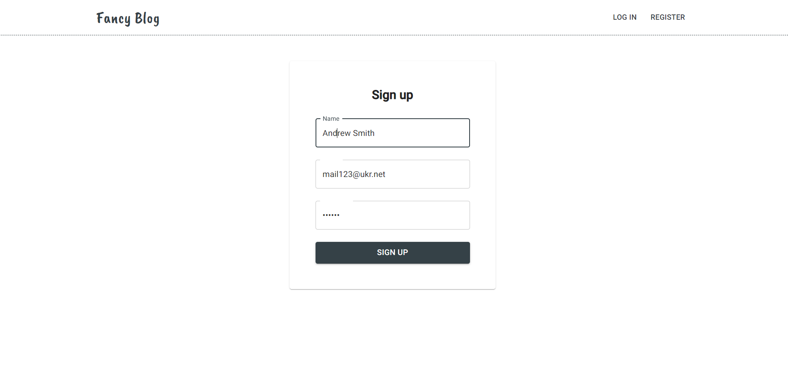

# :book: Table of Content:

- [About The Project](#project-description)
- [Goals and Scenarios](#goals)
- [Technologies](#technologies)
- [Getting Started](#getting-started)
- [Landing page](#landing-page)
- [Screenshots](#screenshots)
- [To do](#todo)
- [Demo](#demo)

## :pencil: About The Project

The development of this project was driven by the motivation to learn how to create and implement full stack applications. During the implementation, I was referring to the MVC pattern. I have practiced writing REST API calls, debugging them using Insomnia program. In addition, I learned to create models using Moongose, controllers, provide JWT authentication and validation with express-validator. I have also become familiar with the use of local storage by storing the user token.
For front-end part I have used Material UI components as well as CSS-Modules / SCSS.

## :rocket: Goals and Scenarios

This is a simple blog where anyone can create an account and write different posts, taking advantage of markdown editor and uploading preview images.
The main functionalities:

- login
- register
- filtering by tag
- write post
- update/delete post

## :computer: Technologies

- ReactJS 18, React Hooks
- React Router v6
- Node.JS, REST API
- MongoDB
- Axios + Fetch
- JWT authentication
- MUI

## :pushpin: Getting Started

First of all download the project. Then in the project directory use the following command to start the application:

```bash
  npm start
```

The app will be in the development mode.\
Open [http://localhost:3000](http://localhost:3000) to view it in the browser.

## Screenshots

### Landing page


### Editing/writing post


### Full post



### Register



## To do

Functionalities to be implemented:

- filtering by popular/new
- adding comments
- adding avatar photo, updating user settings

## Demo

- Current demo version: [https://react-blog-cyan.vercel.app/](https://react-blog-cyan.vercel.app/)
- Backend part : [https://github.com/Anastasiya999/blog-backend](https://github.com/Anastasiya999/blog-backend)
